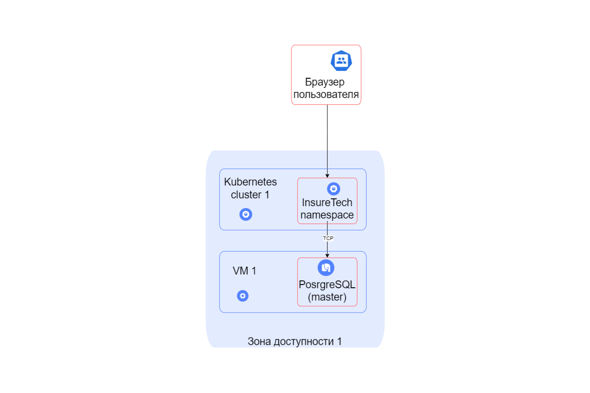
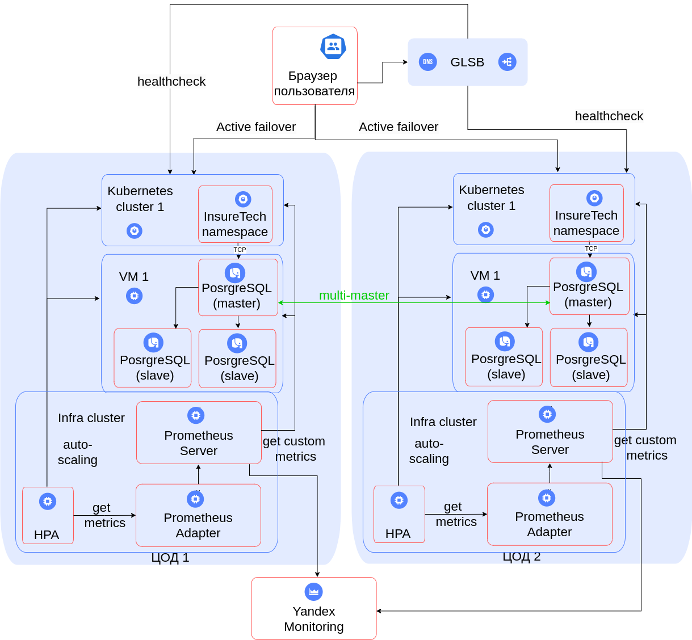

# Задание 1. Проектирование технологической архитектуры

Компания хочет сделать упор на развитие в регионах РФ. Планируется значительный рост количества пользователей и
запросов. Нужно обеспечить бесперебойную работу сервиса 24/7, при этом сервис должен обслуживать клиентов из всех
часовых поясов.

Требования к отказоустойчивости системы крайне высокие:

- RTO — 45 мин.
- RPO — 15 мин.

Дополнительно к этому нужно обеспечить одинаковое время загрузки страниц для пользователей из разных регионов. Оно не
должно зависеть от географического местоположения пользователя.

На текущий момент сервис хранит ограниченный набор данных, который включает в себя:

- базовую информацию о клиентах — ФИО, контакты, документы,
- информацию о продуктах и тарифах,
- историю заявок клиентов.
  Общий объём данных, которые хранятся в системе, равен 50 GB.

Общий объём данных, которые хранятся в системе, равен 50 GB.

### Текущее решение AS IS

# Решение

### Плановое решение TO BE

https://drive.google.com/file/d/1F872Um09Ssx0wwOdyQSLtrWecAbpzZFt/view?usp=sharing

# Определение стратегию масштабирования и отказоустойчивости

### Анализ стратегии вертикального масштабирования

Вертикальное масштабирование не будет эффективно в силу того, что:

- требуется высокая отказоустойчивость (отказ одного дата-центра или кластера приведет к простою)
- компания делает упор на развитии в регионах РФ (клиенты, находящиеся в разных регионах буду получать данные с разной
  задержкой, что противоречит требованиям)

### Анализ стратегии горизонтального масштабирования

Горизонтальное масштабирование будет эффективно для решения проблемы, так как:

- сможет обеспечить требуемую отказоустойчивость (за счет нескольких ЦОД, кластеров и т п)
- сможет обеспечить клиентов с разных регионов примерно одинаковым откликом (в силу расположения ЦОД в разных регионах)

## Принятые решения

### Конфигурация развертывания Kubernetes

В рамках одного ЦОД было принято решение использовать три кластера:

1) Кластер уровня приложения (здесь будут расположены все основные инстансы уровня приложения)
2) Кластер уровня БД (здесь будут расположены инстансы БД PostgreSQL)
3) Кластер уровня инфраструктуры (здесь будут расположены инстенсы для получения метрик, автоскейлинга)

Кластеры, кроме инфраструктурного, должны уметь автоматически масштабироваться в рамках ЦОД через горизонтальное
увеличение количества подов + масштабирование целого кластера. Для реализации этой задачи настроены HPA, а также система
сбора метрик.

### Планирование балансирования нагрузки

Было принято решение использовать несколько геораспределенных ЦОД с балансированием через GSLB. Такое решение позволит
обеспечить примерно одинаковый отклик для клиентов в разных регионах, что является требованием к проектируемой системе.
GSLB будет опрашивать инстансы ЦОД на предмет доступности.

### Файловер-стретегия

В качестве файловер-стратегии выбрана стратегия Active-Active между несколькими ЦОД, так как система требует
бесперебойной работы 24/7, имеет малое время RTO, RPO. Ресурсы ЦОД должны проектироваться таким образом, чтобы в случае
чего, могли принять на себя нагрузку из клиентов от другого ЦОД, пока в сломавшемся ЦОД происходят работы по исправлению
неполадок.

### Конфигурация базы данных

Между кластерами БД ЦОДов предполагается репликация по шаблону multi-master. В рамках одного ЦОД предполагается один
мастер-узел, в который будет просходить запись и две slave-репликации, с которых будет происходить считывание данных.
Такой подход позволит обеспечить бесперебойную работу в случае неполадок как внутри кластера, так и проблем с целым ЦОД.