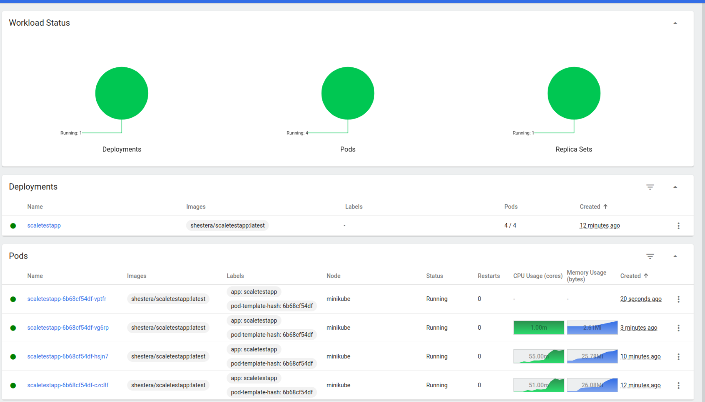
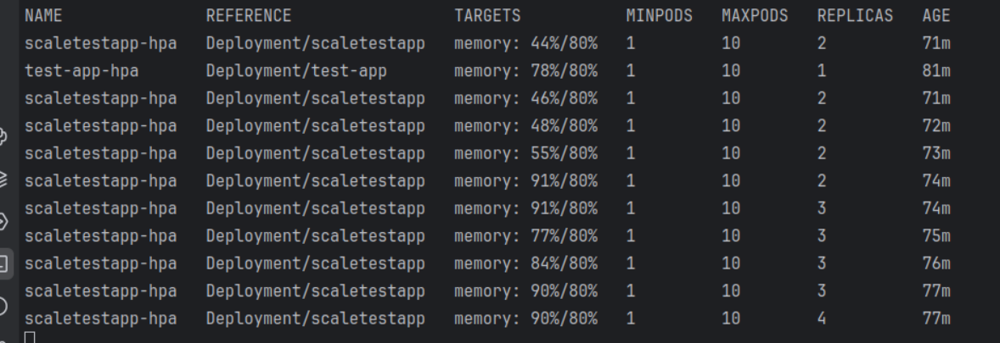
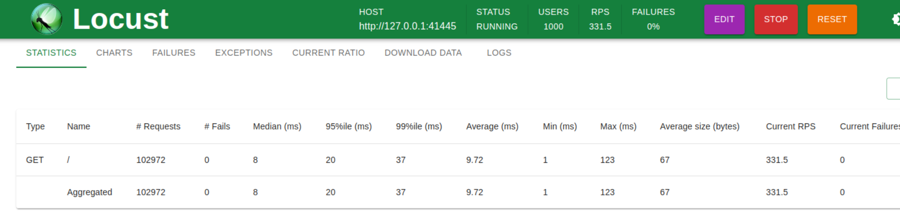

# Задание 2. Динамическое масштабирование контейнеров

Сейчас сервисы InsureTech развёрнуты в Kubernetes. Каждый из них развёрнут в определённом количестве экземпляров.

Обычно этих экземпляров достаточно для успешной обработки всех запросов. Но в периоды пиковой нагрузки система не
справляется: она демонстрирует нестабильное поведение и постоянно перезагружает поды из-за нехватки памяти. Как
следствие, пользователи получают негативный опыт работы с приложением. Бизнес видит, что NPS снижается.

Можно, конечно, держать больше реплик постоянно активными, чтобы система могла справиться с пиковыми нагрузками. Но это
экономически невыгодно и приведёт к низким показателям утилизации ресурсов. Таким образом, вам необходимо решить
проблему с помощью конфигурации динамического масштабирования для сервисов компании.

## Решение

- Mанифест развёртывания (Deployment) Kubernetes для запуска тестового приложения - [deployment.yaml](deployment.yaml)
- Mанифест сервиса (Service) для доступа к приложению [service.yaml](service.yaml)
- Настройка динамической маршрутизации на основании показателей утилизации оперативной памяти с помощью Horizontal Pod
  Autoscaler (HPA) - [hpa.yaml](hpa.yaml)

Логи, демонстрирующие автоматическое увеличение количества подов на возросшую нагрузку:




### Deployment

Применение манифеста Deployment:

```
kubectl apply -f deployment.yaml
```

Проверка запуска подов:

```
kubectl get pods
```

### Service

Применение манифеста Service:

```
kubectl apply -f service.yaml
```

Проверка запуска подов:

```
kubectl get pods
```

### HPA

```
kubectl apply -f hpa.yaml
```

Проверка запуска подов:

```
kubectl get hpa
```

### Развертка приложения

```
minikube service scaletestapp-service --url 
```

### Логи HPA

```
kubectl get hpa -w
```