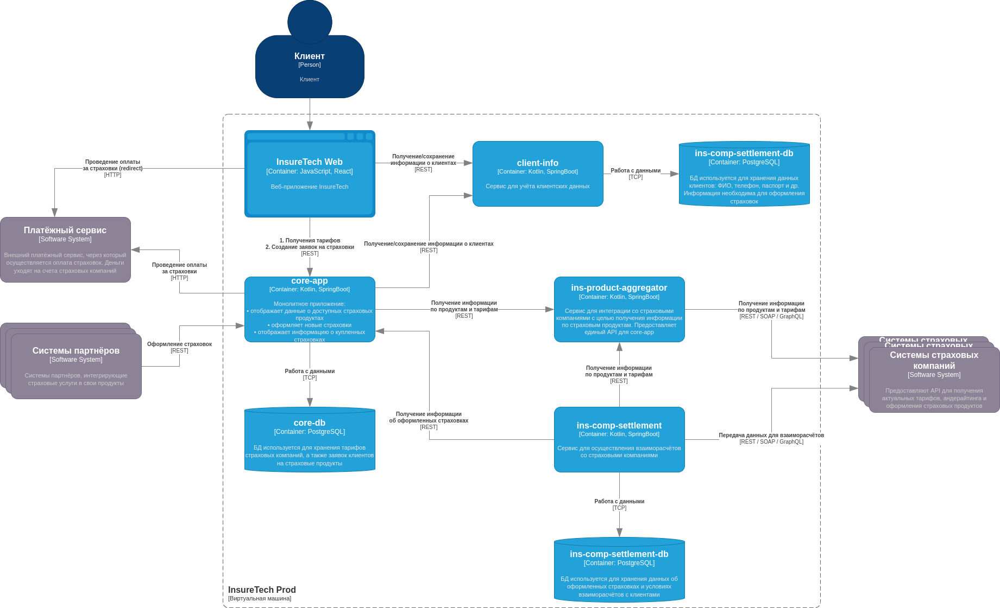
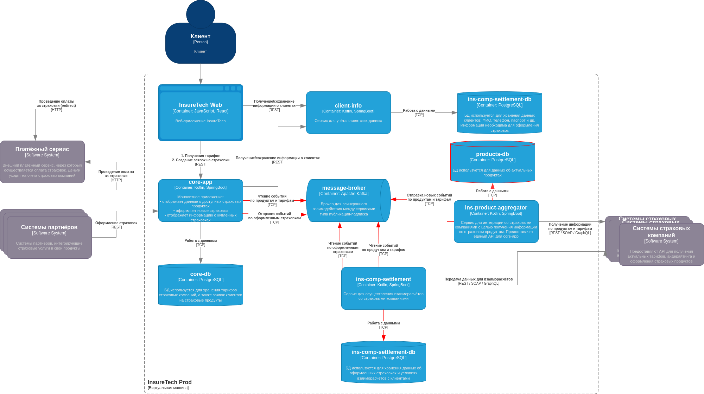

# Задание 3. Переход на Event-Driven архитектуру

Сервисы core-app и ins-comp-settlement получают данные о доступных продуктах через REST API сервиса
ins-product-aggregator. В момент вызова он:

- запрашивает информацию из всех страховых компаний (сейчас их пять),
- агрегирует её в единый список,
- возвращает этот список в рамках того же синхронного запроса.

Чтобы ускорить работу сервисов, при изначальном проектировании команда решила хранить локальные реплики данных о
продуктах и тарифах в сервисах core-app и ins-comp-settlement.
Сервис core-app осуществляет запрос к ins-product-aggregator раз в 15 минут, а ins-comp-settlement — раз в сутки (
ночью), при формировании реестра оформленных страховок. Иногда команда сталкивается с ошибками взаимодействия между
этими сервисами. Они связаны с задержками ответов или ошибками при взаимодействии с API страховых компаний.

Дополнительно сервис ins-comp-settlement раз в сутки осуществляет запрос в core-app по REST API для получения всех
оформленных за день страховок. Эти данные он использует.

В ближайшее время InsureTech планирует подписать агентское соглашение ещё с пятью страховыми компаниями. Вам предстоит
спроектировать решение, которое устранит текущие проблемы.

Что нужно сделать:

1) Проанализируйте текущую архитектуру. Создайте текстовый документ и напишите там список проблем и рисков, которые
   связаны с планируемым ростом нагрузки. Когда всё будет готово, загрузите документ в директорию Task3 в рамках
   пул-реквеста.
2) Обновите диаграмму контейнеров InsureTech, предложив решения для выявленных вами рисков и проблем. При этом:

- Не меняя декомпозицию функциональности между сервисами, подумайте, какие взаимодействия стоит переделать на
  Event-Streaming.
- Решите, будете ли вы использовать паттерн Transactional Outbox.

# Решение

## Анализ проблем и рисков, связанные с планируемым ростом нагрузки

1) С увеличением роста страховых компаний увеличится время ожидания аггрегированного ответа от сервиса
   ins-product-aggregator, в следствии чего проблема с медленной загрузкой страниц пользователей только усугубится, что
   еще сильнее ухудшит пользовательский опыт.
2) В случае увеличения числа клиентов, а также покрытия сервисом многих новых регионов, нагрузка на сервис core-app
   может существенно возрасти. Кроме того, количество оформленных сделок также кратно увеличится. Это означает, что
   запросы ночью в сервис core-app от сервиса ins-comp-settlement могут еще больше нагрузить сервис core-app и если
   оформленных сделок много, то эта повышенная нагрузка может занять еще и приличное время.
3) Сервис ins-comp-settlement довольно редко забирает данные об оформленных сделках от core-app. В случае большого
   количества ранее проведенных сделок, неудачно выбранного времени между запросами к core-app, а также момента
   окончания месяца, есть вероятность, что сервисы-партнеры не получат корректные данные обо всем совершенных сделках в
   силу того, что ins-comp-settlement не успеет забрать все данные вовремя.

## Предлагаемое решение

https://drive.google.com/file/d/1dlVagbePoH2gkb-v9DMicB29sOGDBsxa/view?usp=sharing

1) Заменить синхронные запросы от core-app и ins-comp-settlement на получение событий по продуктам и тарифам от
   ins-product-aggregator. Это позволит значительно улучить пользовательский опыт и решить проблему с медленной
   загрузкой страницы. С помощью репликации необходимых данных сервисы core-app и ins-comp-settlement будут всегда
   обладать актуальной для себя информацией о доступных тарифах. Сервису core-app больше не потребуется долго ожидать
   ответа от ins-product-aggregator. Использовать общий топик Kafka для обоих сервисов-подписчиков.
2) Завести шедулер в сервисе ins-product-aggregator, раз в <бизнес-метрика>(1-2-3-5) минут опрашивающий все страховые
   компании на предмет изменения тарифов. Добавить сервису базу данных products-db, чтобы отслеживать актуальное
   состояние тарифов и не отправлять события без изменений. Также хранить историю тарифов, что может быть полезно для
   аналитики или при анализе инцидентов.
3) Заменить синхронный запрос от сервиса ins-comp-settlement к сервису core-app на отправку сервисом core-app данных об
   оформленных страховках и подписке на эти события сервиса ins-comp-settlement. В данном варианте больше подошла бы
   очередь и тип взаимодействия точка-точка, но так как в п.1 явно нужны события типа публикация-подписка и использована
   Kafka, не целесообразно с точки зрения ресурсов поднимать дополнительный инстанс очереди (например, RabbitMQ), можно
   воспользоваться и отдельным топиком Kafka. Данное решение поможет справиться с проблемами 1-2, описанными в пункте "
   Анализ проблем и рисков, связанные с планируемым ростом нагрузки"
4) При записи данных о проведенной сделки в PostgreSQL и при отправке события в Kafka в core-app необходимо использовать
   паттерн Transactional Outbox, чтобы два действия (запись в БД и отправка в Kafka) происходили атомарно.
5) При записи данных о новых тарифах в PostgreSQL и при отправке события в Kafka в ins-product-aggregator необходимо
   использовать паттерн Transactional Outbox, чтобы два действия (запись в БД и отправка в Kafka) происходили атомарно.
