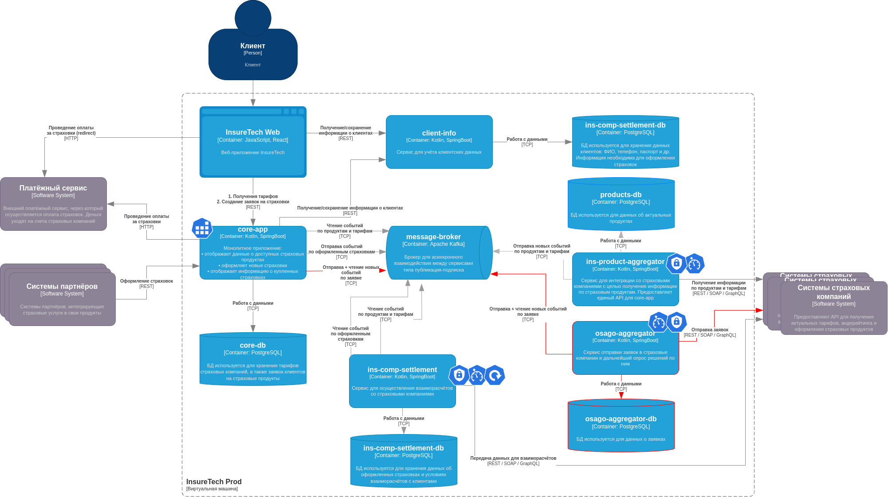

# Задание 4. Проектирование продажи ОСАГО

Компания планирует вскоре запустить новый продукт: оформление ОСАГО онлайн. Пользовательский путь выглядит так: клиенту
предлагается заполнить заявку с информацией о своём автомобиле, после этого сервис запрашивает у всех доступных
страховых компаний предложения с условиями страхования под заявку клиента. Бизнесу важно, чтобы на экране пользователя
предложения от каждой страховой компании отображались сразу, как только от неё пришёл ответ. Максимальное время ожидания
решения от страховой компании — 60 секунд.
Все страховые компании предоставляют однотипные REST API с двумя эндпоинтами:

- создать заявку на ОСАГО,
- получить предложение по заявке.

Бизнес предполагает, что в пик нагрузки количество одновременных пользователей, создающих заявку на ОСАГО, может
достигать 2,5 тысячи человек.

Вы обсудили задачу с командой разработки и приняли такие решения:

- Сохранить подход, который использовался для получения данных о продуктах и тарифах из страховых компаний.
- Выделить отдельный сервис для взаимодействия со страховыми компаниями — osago-aggregator.

Функциональная обязанность этого сервиса — отправка заявок в страховые компании и дальнейший опрос решений по ним для
передачи результатов в core-app. Остальная функциональность, связанная с оформлением ОСАГО, остаётся на стороне бэкенда
в core-app.

# Решение

https://drive.google.com/file/d/1K4UWwr3niuWtn4OjeRZsgYQoiO18DEdO/view?usp=sharing

Основные пункты решения:

1) Новому сервису нужно хранилище osago-aggregator-db, для того, чтобы не терять заявки в случае сбоев (например,
   падения сервиса), а также для хранения данных обо всех обработанных заявках, что может быть полезно для аналитики и
   анализе инцидентов.
2) Взаимодействие с core-app будет происходить через событийную архитектуру. В данной ситуации, скорее всего, подошла бы
   модель точка-точка, но в силу того, что уже было выбрано решение в виде Kafka, можно использовать в качестве очереди
   топик Kafka.
3) Инициатором события по заявке будет выступать core-app. Данное событие будет прочитано osago-aggregator, который
   далее пойдет опрашивать сторонние компании. Полученные ответы будут попадать в БД и в Kafka с использованием паттерна
   Transactional Outbox. В случае недоступности стороннего сервиса можно использовать паттерн Retry.
4) Оба сервиса будут читать топики для получения событий и писать в топики для отправки событий по заявкам.
   Взаимодействие асинхронное. В моменте, когда заявка будет рассчитываться сервисом osago-aggregator, клиент может
   видеть перед собой окно, показывающее статус обработки его обращения. В качестве будущих улучшений можно рассмотреть
   вариант с частичными событиями и ответу "по готовности" из сервиса osago-aggregator, чтобы клиент мог сразу видеть те
   страховые, по которым уже готов расчет, чтобы не дожидаться окончания процесса.
5) Стоит добавить паттерн Retry в сервис ins-comp-settlement, так как данные, которые он отправляет сторонним сервисам
   крайне важны и должны быть обязательно доставлены
6) Стоит добавить паттерн Rate Limiter в core-app, чтобы предотвратить попытки излишнего обращения к API систем
   партнеров. Использовать паттерн Token Bucket.
7) Стоит добавить паттерн Circuit Breaker в сервисы взаимодействия с внешними партнерами для опроса:
   ins-product-aggregator, osago-aggregator. Это поможет повысить стабильность системы и уменьшить число ошибок от
   сторонних сервисов.
8) Кроме того, стоит добавить паттерн Timeout ко всем сервисам (ins-product-aggregator, osago-aggregator,
   ins-comp-settlement), которые взаимодействую со сторонними сервисами, чтобы предотвратить бесконечное ожидание
   ответа.
9) В случае горизонтального масштабирования core-app важно, чтобы события, которые были отправлены в Kafka по конкретным
   клиентам были прочитаны тем же инстансом core-app из Kafka после их обработки. Решить эту проблему можно с
   использованием механизма keyed consumers Kafka по уникальным данным пользователя (например, по его идентификатору).
   Каждый инстанс core-app будет читать данные со своей ключевой партиции топика, а тот, кто отправляет события (
   ins-product-aggregator, osago-aggregator) для core-app будет записывать данные в определенную партицию по ключу
   идентификатора пользователя. Работать это будет только в одну сторону, так как эта проблема актуальна только для
   сервиса, который взаимодействует с пользователями.
10) В силу п9 также важно, что в случае, когда инстансов core-app станет больше, потребуется балансироващик нагрузки
   между core-app и клиентами, и балансировка нагрузки должна происходить по аналогичному сценарию, что и в Keyed
   Consumers Kafka, с использованием одинаковой хеш-функции. Такой подход позволит одним и тем же инстансам обрабатывать
   одних и тех же клиентов и читать всегда "свои" топики Kafka, что позволит не потерять данные ответов по конкретным
   клиентам в случае сбоя.
